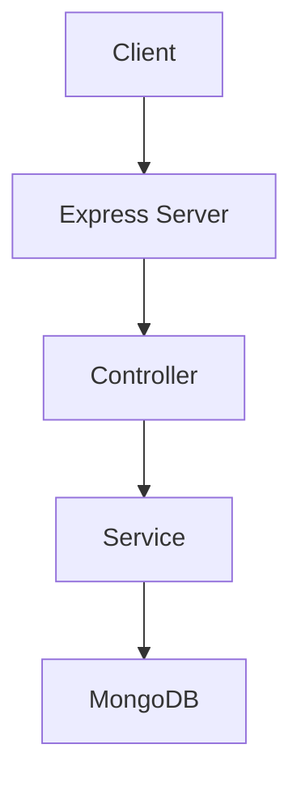
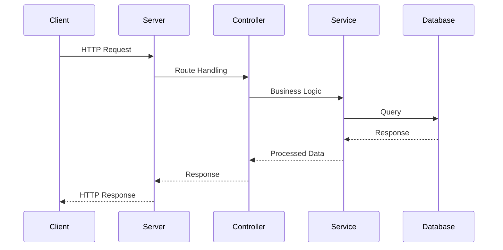

# Sample Node.js Application

This document provides an overview of a sample Node.js application, including architecture and flow diagrams created using Mermaid.

## Table of Contents
- [Introduction](#introduction)
- [Architecture](#architecture)
- [Flow Diagram](#flow-diagram)
- [References](#references)

## Introduction

This sample Node.js application demonstrates a basic setup with Express.js, MongoDB, and a simple REST API.

## Architecture

## Flow Diagram

## References

- [Node.js](https://nodejs.org/)
- [Express.js](https://expressjs.com/)
- [MongoDB](https://www.mongodb.com/)